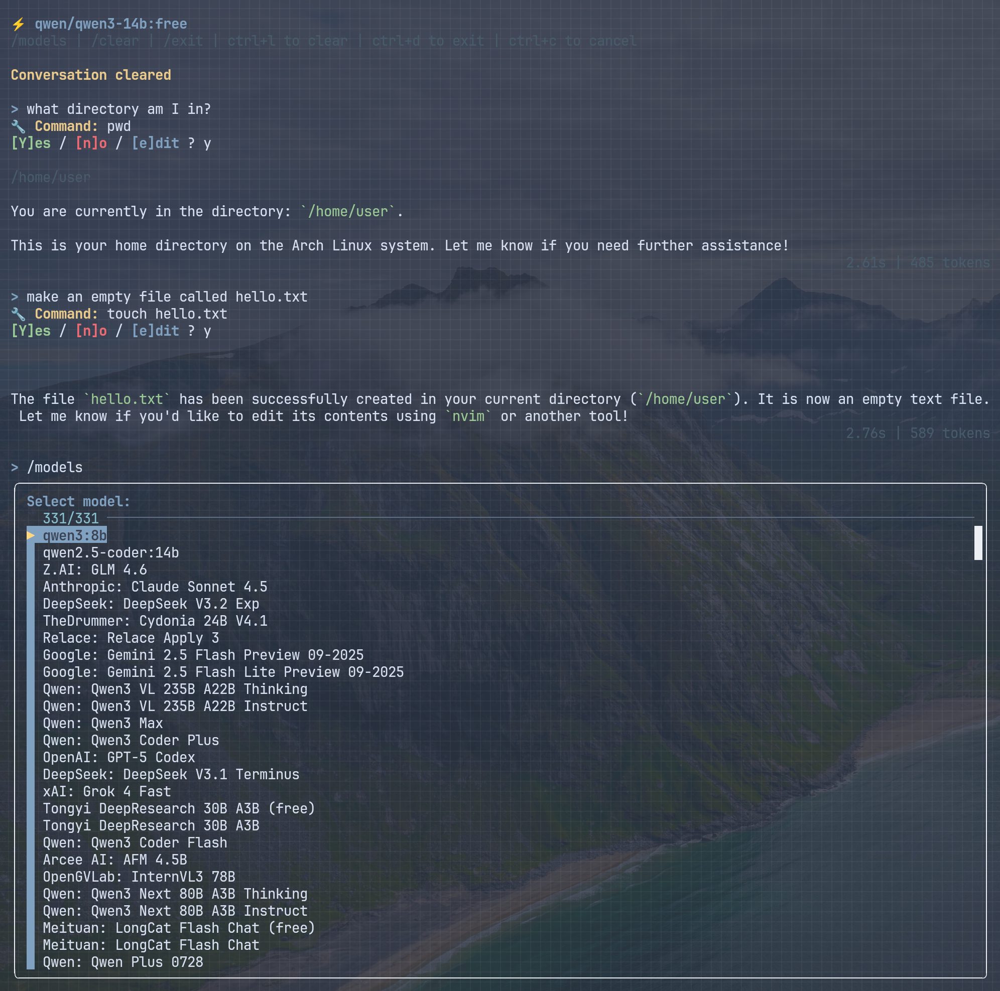

# llm-cli

A lightweight bash script for interactive CLI conversations with LLM models via OpenAI-compatible APIs.



## Features

- **Command execution** - AI can run system commands with user confirmation
- **Markdown rendering** (with bat or mdcat)
- **Model switching** on the fly (with fzf)
- **Context-aware** - includes system info (date, distro, shell, editor)
- **Interactive chat interface** with conversation history
- **Readline support** - history, arrow keys, ctrl+l to clear

## Installation

1. Clone or download `llm.sh`
2. Make it executable: `chmod +x llm.sh`
3. Install dependencies for better experience:
   ```
   # For model selection menu
   sudo pacman -S install fzf
   
   # For markdown rendering
   sudo pacman -S bat or mdcat
   ```

## Configuration

Edit the script to set your API endpoint and key:

```bash
API_BASE="http://your-server:8080/api"
API_KEY="your-api-key"
MODEL="your-model-name"
```

### API Compatibility

The script uses the OpenAI chat completions format (`/v1/chat/completions`). It works with:

- **Open WebUI** - Use your Open WebUI API endpoint and key
- **OpenRouter** - Should work with `https://openrouter.ai/api` and your OpenRouter key
- **Any OpenAI-compatible API** (Ollama, LM Studio, vLLM, etc.)

### Model Fetching

The `/models` command fetches available models from `/v1/models` endpoint and displays them in an interactive menu (requires fzf). This endpoint returns a list of models in OpenAI format:

```json
{
  "data": [
    {"id": "model-id", "name": "Model Name"},
    ...
  ]
}
```

If your API provider implements this endpoint, model switching will work automatically.

## Usage

Run the script:
```bash
./llm.sh
```

### Commands

- `/models` - Switch model (interactive menu)
- `/clear` - Clear conversation history
- `/exit` - Exit (or use Ctrl+D)
- `Ctrl+L` - Clear conversation
- `Ctrl+C` - Cancel current request

### Command Execution

The AI can execute system commands using `[RUN:command]` syntax. You'll be prompted to confirm, deny, or edit each command before execution:

```
🔧 Command: ls -la
[Y]es / [n]o / [e]dit ?
```

## Example

```
> what files are in this directory?
[RUN:ls -la]
🔧 Command: ls -la
[Y]es / [n]o / [e]dit ? y

total 48
drwxr-xr-x  6 user user  4096 Oct  3 10:30 .
drwxr-xr-x 20 user user  4096 Oct  3 10:25 ..
-rwxr-xr-x  1 user user  8429 Oct  3 10:30 llm.sh
...

You have several files including the llm.sh script itself, 
some hidden git files, and a README.md.
```
